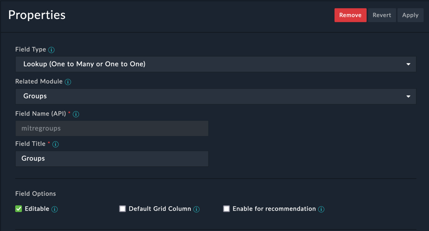
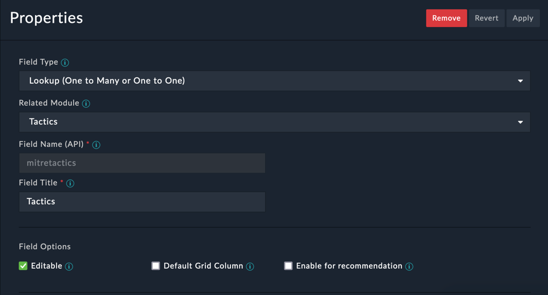
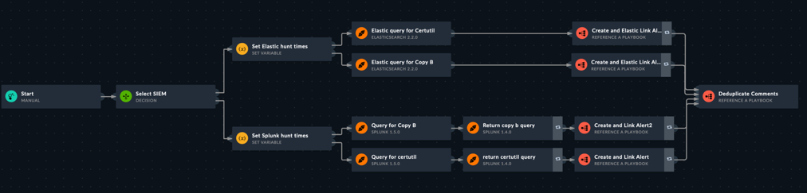
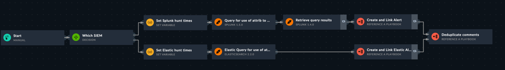
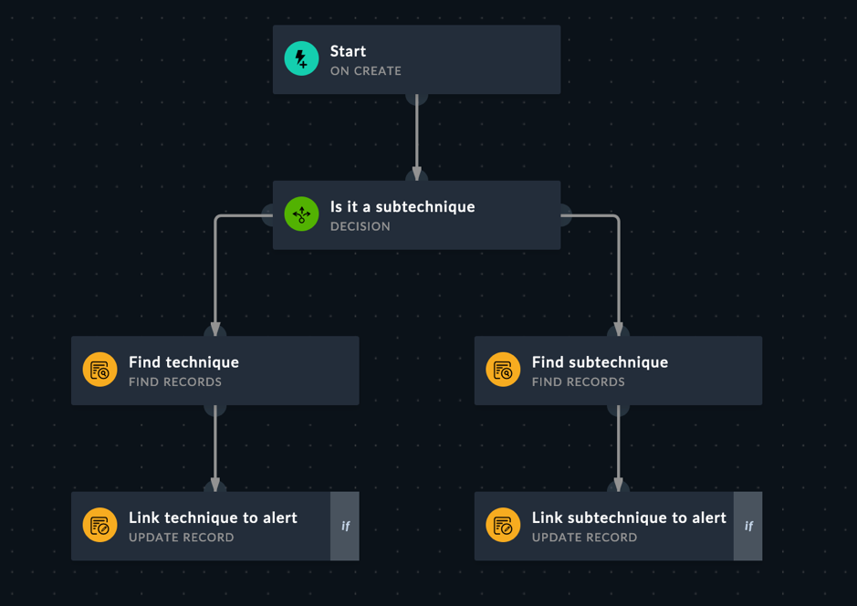
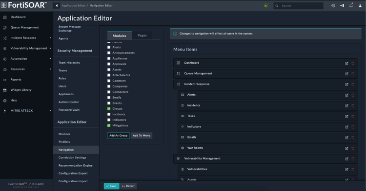
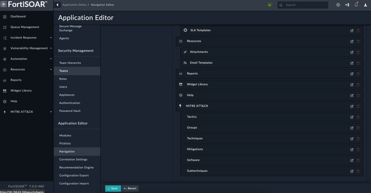
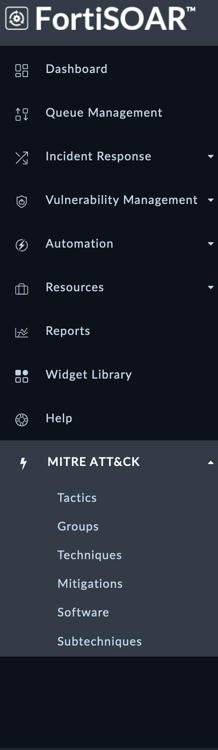

# **MITRE ATT&amp;CK Framework - Content Pack**

## **Overview**

This article describes the FortiSOAR™ Incident Response Content Pack (FSR-IR-CONTENT-PACK or Content Pack) for MITRE ATT&amp;CK Framework. This content pack enables users to use the information and knowledge base that&#39;s provided by the MITRE ATT&amp;CK Framework to its full extent.

&quot;MITRE ATT&amp;CK is a globally-accessible knowledge base of adversary tactics and techniques based on real-world observations. The ATT&amp;CK knowledge base is used as a foundation for the development of specific threat models and methodologies in the private sector, in government, and in the cybersecurity product and service community.&quot;

## **Setting up the MITRE ATT&amp;CK content pack**

You can use the MITRE ATT&amp;CK content pack to map alerts, incidents, and indicators to MITRE Tactics and Threat Actors; and also hunt for specific tactics in your environment using pre-configured playbooks.
You can setup the MITRE ATT&amp;CK Content Pack as follows:

1. Deploy the Content Pack.
2. Review the contents of the MITRE ATT&amp;CK Framework Content Pack.
3. Setup data ingestion for the MITRE database using the MITRE ATT&amp;CK Connector.
4. Setup modules to lookup MITRE ATT&amp;CK Tactics and Groups.
5. Leverage Hunt Playbooks to look for specific tactics in your environment. Use cases and screenshots from some hunt playbooks are included in the Use Case Workflow section.

### **Deploying the MITRE ATT&amp;CK Framework Content Pack**

1. Download and extract the &quot;Content\_Pack.json.zip&quot; file that is attached to this document.
2. Unzip and import the &quot;Content\_Pack.json&quot; file using the following steps:
  1. Open the FortiSOAR instance, and click **System Settings**.
  2. In the &quot;Application Editor&quot; section, click **Configuration Import**.
  3. On the &quot;Configuration Import&quot; page, click **Import From File** to open the Import Configurations Wizard.
  4. Upload the &quot;Content\_Pack.json&quot; file and click **Continue**.
  5. On the &quot;Configuration&quot; page, review the list of configurations that are displayed, and then click **Continue**.
**Important** : All the configuration options displayed on this page are required.
  6. On the &quot;Review Import page&quot;, review the import details that you are importing and then click **Run Import** to begin the import process.
 Once the import is completed, the MITRE ATT&amp;CK Framework is deployed.

### **Integrations used**

- MITRE ATT&amp;CK

### **Inside the MITRE ATT&amp;CK Framework Content Pack**

###

- MITRE ATT&amp;CK Modules
  - Groups
  - Tactics
  - Techniques
  - Sub-techniques
  - Mitigations
  - Software
- MITRE ATT&amp;CK Module View Templates
- MITRE ATT&amp;CK Picklists
  - MITRE ATT&amp;CK Matrices
  - MITRE ATT&amp;CK Software Types
- Roles
  - Updates to the default Full App Permissions Role to include permissions for the new MITRE modules
  - New MITRE Admin Role
- Navigation menu that includes MITRE ATT&amp;CK modules
- Hunt Playbook Collections
  - Access Token Manipulation
    - SID-History Injection (T1134.005)
  - Boot or Logon Autostart Execution
    - Winlogon Helper DLL (T1547.004)
  - Credential Access
    - OS Credential Dumping (T1003)
  - Defence Evasion
    - Deobfuscate/Decode Files or Information (T1140)
    - Rogue Domain Controller (T1207)
  - Event Triggered Execution
    - AppInit DLLs (T1546.010)
    - Hidden Files and Directories (T1564.001)
    - Netsh Helper DLL (T1546.007)
    - Screensaver (T1546.002)
  - Process Execution
    - Dynamic Data Exchange (T1559.002)
    - LSASS Driver (T1547.008)
    - XSL Script Processing (T1220)
  - Signed Binary Proxy Execution
    - CMSTP (T1218.003)
    - Compiled HTML File (T1218.001)
    - Control Panel Items (T1218.002)
    - InstallUtil (T1218.004)
    - Mshta (T1218.005)
    - Regsvcs/Regasm (T1218.009)
    - Rundll32 (T1218.011)
  - System Services
    - Service Execution (T1569.002)
- Modulars: These playbooks are used for deduplication and linking of hunt-related records.

### **Setting up Data Ingestion**

The MITRE ATT&amp;CK Connector leverages the ingestion wizard for seamless ingestion of the MITRE ATT&amp;CK Framework on a set schedule and also provide inputs that specify which MITRE ATT&amp;CK matrix should be used for pulling the data. For more information on setting up data ingestion, see the [MITRE ATT&amp;CK](https://docs.fortinet.com/document/fortisoar/2.0.0/mitre-att-ck/149/mitre-att-amp-ck-v2-0-0) connector document that is included in the [FortiSOAR Connectors](https://docs.fortinet.com/fortisoar/connectors) listing page.

**Important** : Ensure that you add a &#39;Weekly Update Schedule&#39; to keep your data synchronized with the latest updates in the MITRE ATT&amp;CK Framework.

When you install the MITRE ATT&amp;CK Connector using this content pack a preconfigured ingestion is automatically activated, which schedules a pull for every Sunday midnight UTC. You can rerun the data ingestion wizard to change these preconfigured settings. See the [MITRE ATT&amp;CK](https://docs.fortinet.com/document/fortisoar/2.0.0/mitre-att-ck/149/mitre-att-amp-ck-v2-0-0) connector document on how to set up/reconfigure data ingestion.

### **Setting up modules to lookup MITRE ATT&amp;CK Tactics and Groups**

###

The MITRE ATT&amp;CK content pack includes new lookup fields for MITRE ATT&amp;CK Tactics and Groups in the Alerts and Incidents modules, which you can choose to manually update or automatically update during ingestion. If there is a conflict in your environment while exporting the included Alerts and Incidents modules, you can choose to create these lookup fields yourself, by performing the following steps (identical for both modules or for any custom modules):

1. To create MITRE ATT&amp;CK Tactics and Groups for the Alerts module, click **Settings** \&gt; **Application Editor** \&gt; **Modules**.
2. On the Modules page, select the **Alerts** module, and click the **Fields Editor** tab. To add the new &#39;Groups&#39; lookup field, click **+** and set its properties as shown in the following screenshot:
   
3. Add the new &#39;Tactics&#39; lookup field, click **+** and set its properties as shown in the following screenshot: 

### **Use Case Workflow**

Hunt playbooks are designed to provide a basic structure and usable examples for conducting MITRE ATT&amp;CK specific threat hunting operations using FortiSOAR.

- All Hunt playbooks have the following workflow pattern:
  - Manual trigger of the hunt playbooks by users that prompts a SIEM choice between Splunk and Elastic.
  - Run a query based on the MITRE Technique details on the selected SIEM.
  - Retrieve query results.
  - Create alerts based on the query results.
  - Add comments on created alerts that describe the workflow resolutions.
  - Deduplicate the comments that create clutter.
- After a hunt playbook is executed, the new alerts are linked to the appropriate MITRE Techniques and/or Sub-techniques.

#### Screenshots of &#39;Hunt&#39; Playbooks used in user cases

 Screenshot from the &quot;Deobfuscate/Decode Files or Information (T1140)&quot; Hunt playbook. This playbook demonstrates the use of Certutil or copy /b to deobfuscate data/files.

 Screenshot from the &quot;Hidden Files and Directories (T1564.001)&quot; Hunt playbook. This playbook hunts for attrib.exe, which is used to hide files.

 Screenshot from the &quot;Link ATT&amp;CK technique to Alert&quot; playbook. This playbook links the &#39;Alert&#39; records that were created as a result of Hunt playbooks to their related MITRE ATT&amp;CK techniques and subtechniques.

### **Setting up the Navigation View**

The content pack doesn&#39;t include the navigation view that contains the new MITRE modules by default. This is due to navigation view imports overwriting the view altogether. After you import the content pack the new modules still need to be added to the navigation view. Following is a set of screenshots which describes this process.

 Adding all the MITRE modules as a group will put them in a dropdown folder of their own.

 

You can change the name and icon of the folder as well as the individual names and icons of the module pages if you prefer.

 
